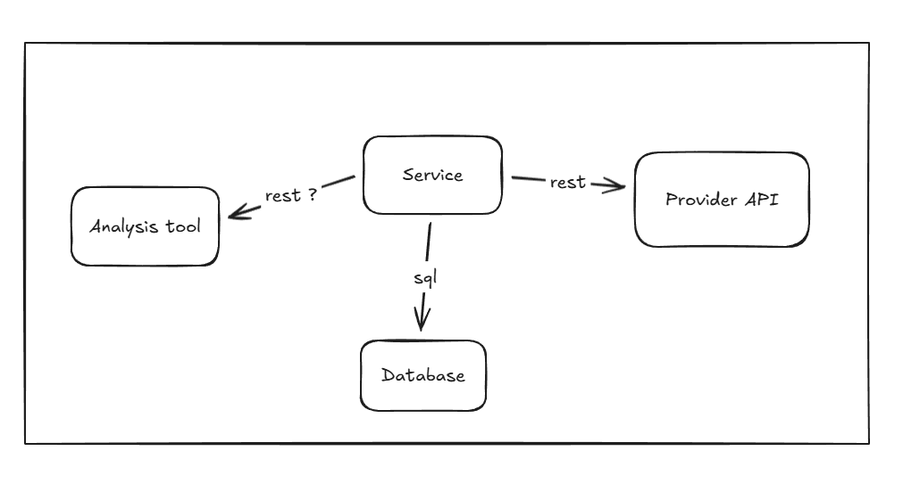
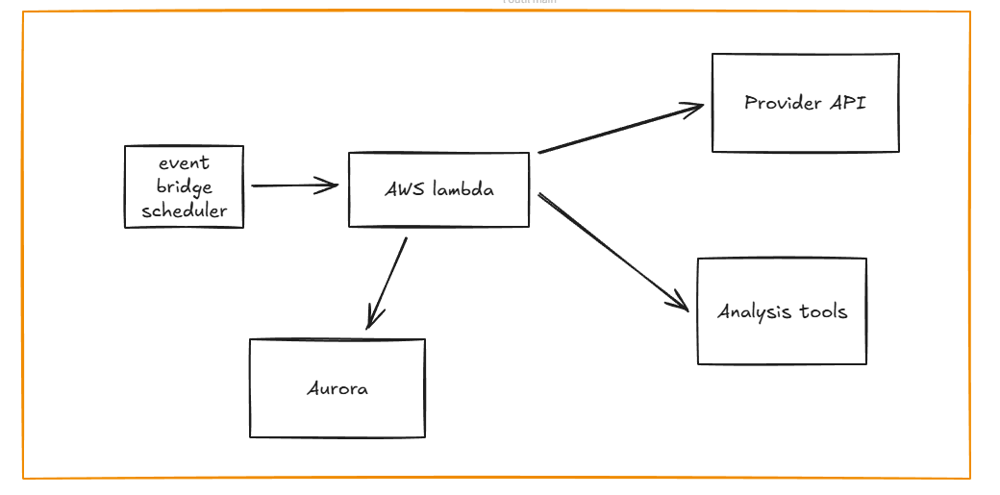

# Mail tool

Fake security email tool

It is design to run infinitly and one per tenant. the archi is quite simple and looks like the following schema

This version is a simple docker image that could be deployed wherever we want. The current limitation is one process per tenant.
The database is Sqlite for demo and so is embedded, but in the real world it will be an external db that has to be configured too.

It could be modifiy a bit to fit to a serverless version that might be easier to maintain and uses scaling capabilities of AWS infra.

TODO for next steps:

    - fraud / phishing detection tool
    - clean error management (for now it's only logging)
    - statistics
    - Possibly store users list and refresh only once a day or less.
    - trigger some events on fraud detection
    - manage emails via provider quarantine APIs if any.

## Build docker image
    
    docker build -t mailtool .

## Run

Since there is env vars required, don't forget to add them. API_PROVIDER is unused for now so you can put anything you want. TENANTID must just be in uuid format, but is also not validated yet.

    docker run -e MAILTOOL_API_PROVIDER=m365 -e MAILTOOL_TENANTID=884611ea-6e1f-457d-88a8-a0d9ca2e2e31 -it mailtool

You can check data in database with following command

    docker exec -it $CONTAINER_ID sqlite3 /data/gorm.db "select * from suspicious_emails"

CONTAINER_ID is the id of the running container, you can find it with something like

    docker ps | grep mailtool | cut -f1 -d" "